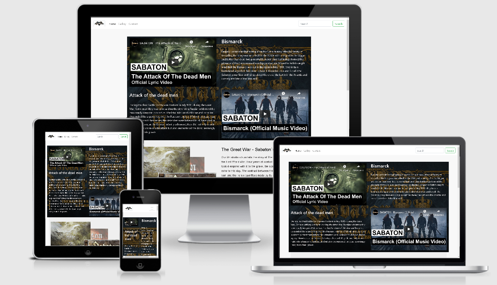
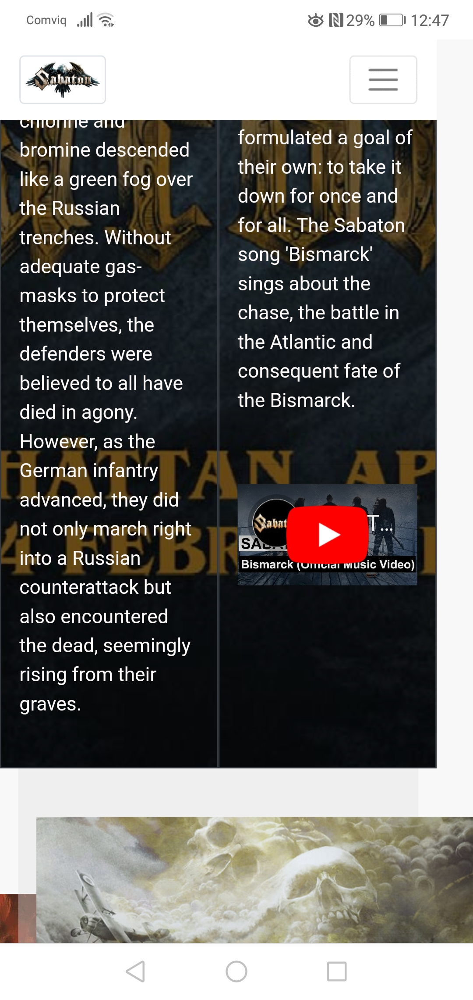
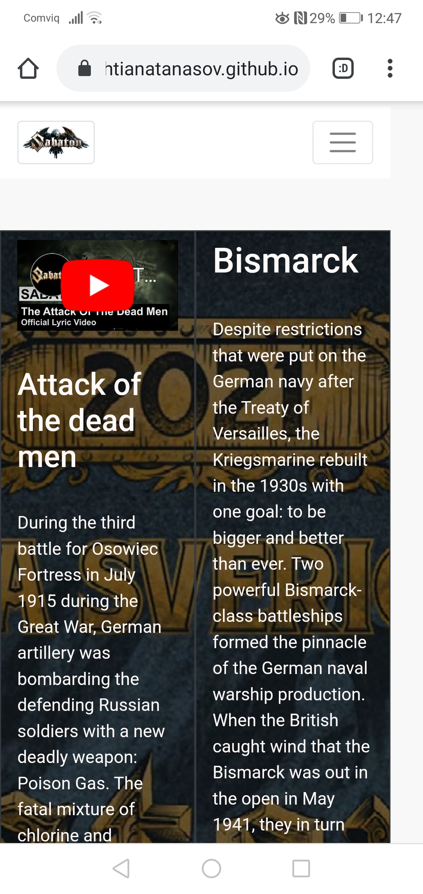

# Sabaton band website

This site will be an ongoing static page, designed to present some general information about the metal band Sabaton.

It`s creation is for my first milestone project as a Full Stack software developer student of the Code Institute (https://codeinstitute.net/), 
with the goal of introducing the band to the user as in showcasing some of their latest music videos, providing some backstory and
history behind the creation of said music videos, showing off the newest band album and listing the upcoming live concerts.

## UX

 The purpose of the site is a simple introduction to my favourite rock band as well as providing some general information.

 #### User Stories

   * As a newcomer, I would like to sample some of the band`s latest hits.

   * As a person new to the band, I would like to familiraze more with the band ideology behind their songs as well as see some photos of live performances.

   * As an avid Sabaton fan, I would like to check upcoming live shows for the band.

   * As a fan, I would like to purchase their latest album, and check their contacts so that I can send some fan letters.

   * As a promoter, or a venue owner I would like to contact the apropriate people for booking a live show.

 ## Features

### Existing Features

  * __Home page__ - The home page contains most of the current features. There are 3 main sections - the first one has 2 of the bands latest videos as well as some background behind the inspiration they had in creating the songs. The second one contains their latest album and the Buy button. And the third is a list of their upcoming live shows.

  * __Gallery__ - A simple library of select photos from the band. Some of them are staged some of them are from live concerts.

  * __Contact__  - A simple page that holds some basic contact information for the band and their managers, as well as the address to which to send fan mail.

  ###  Features Left to Implement

  * __History__ - Creating a page to showcase more detailed information about each individual in the band.

  * __Home page__ - Expand the concert section of the page with more upcoming concerts as well as a ticket booking option for chosen concert.

  * __Gallery__ - Expanding the current picture library.

  * __Contact__ - Adding a section where you can send an email directly from the page instead of just listing said emial addresses.

  
 ## Technologies Used

 1. **HTML:** Used to construct all the pages of this web site. For more information on the language;   
 https://developer.mozilla.org/en-US/docs/Web/HTML

 2. **CSS:** Is used to style various elements on a web page via coloring, fonts, spacing, etc. For further info, see this link;
 https://www.w3.org/Style/CSS/Overview.en.html

 3. **Bootstrap:** A CSS framework that assists the programmer in creating responsive, mobile first front-end web sites.  https://getbootstrap.com/

 4. **Gitpod:** An online IDE also used for creating & saving code that runs in a browser, it does not have to be installed on your PC.
 https://www.gitpod.io/

 5. **Git:** A version control system for tracking changes in source code during software development.  https://git-scm.com/

 6. **GitHub:** A company that provides hosting for software development version control using Git. It is a subsidiary of Microsoft. https://github.

 7.  **W3C Markup Validation Service** Used to run all html and css code thru a validation process looking for errors; https://validator.w3.org/
 https://jigsaw.w3.org/css-validator/validator

 ## Testing

 1.  http://ami.responsivedesign.is/  has been used to see how the site performs on different devices and their viewports, all pages, links, icons performed as expected on all devices. I also used it to create the AmIResponsive.jpg at the top of this Readme.

 2.  **Desktop**
     
       * Opera Web Browser, Internet Explorer 11 & Google Chrome browsers; all pages, links on those pages, and footer icon links perform well on all viewport sizes. 

 3.  **Mobile**

      *  Used my Huawei P20 lite, as well as roommate's Huawei P30 PRO and my landlord`s Samsung Galaxy S10 smartphone to ;  all pages, links, icons performed well on all devices using various browsers; Mozilla & Chrome.      

 4.  **Open Issues:**  Only current issue that I have encountered during testing is that, altho the videos in the Home page are responsive they can get a bit too small on certain devices as seen in the pictures bellow.
 

 

         
## Deployment

  1. Created a Github account at https://github.com
  My account url;    https://github.com/NihtianAtanasov

  2. I uploaded all files to my Github repository located at this url; https://github.com/NihtianAtanasov/First-Project which is for this individual project.

  3. To publish the project to see it on the web, I then went into the Settings on my respository, scrolled down to the heading, GitHub Pages. Under the Source setting, I used the drop-down menu to select master branch as a publishing source and saved it. Refreshed the github page, and you are then given a url where your page is published;
   Your site is published at https://nihtianatanasov.github.io/First-Project/

  4. To run this code on your local machine, you would go to my respository at 
https://github.com/NihtianAtanasov/First-Project and on the home page on the right hand side just above all the files, you will see a green button that says,
"Clone or download", this button will give you options to clone with HTTPS, open in desktop or download as a zip file.
To continue with cloning, you would;
  * Open Git Bash
  * Change the current working directory to the location where you want the cloned directory to be made.
  * Type git clone, and then paste this URL; https://github.com/NihtianAtanasov/First-Project  Press Enter. Your local clone will be created.

  For more information about the above process; https://help.github.com/en/github/creating-cloning-and-archiving-repositories/cloning-a-repository

## Credits

### Content

   1. HTML & CSS Timeline code directly from;  Bootstrap 3.3.0 Snippet by evarevirus;  https://bootsnipp.com/snippets/ZV7pD.
      Used on my Contact page.

   2. The love runnig website from codeinstitute for my idea on how to create and style the concert list as well as 
   my Gallery page.

   3. HTML & CSS Timeline code directly from; Sorry I lost the link. 
      Used on my album section in Home page.

### Media

   1. Am I Responsive web site for checking responsiveness on all Apple devices screen sizes;
   http://ami.responsivedesign.is/

   2. https://stackoverflow.com/  Used as a resource for finding answers to all types of coding problems.

   3. Font Awesome for the icons in my footer; https://fontawesome.com/

### Acknowledgements

1. Code Institute's Slack Channels and the many alunni,mentors, tutors and users who contribute to them; the many pinned announcements, pdf files, etc. were of great help.
https://app.slack.com/client/T0L30B202/C0L316Z96

2. Mentor Adegbenga Adeye for site architecture inspiration, programming help, major revelations on website flaws great advice.
https://www.linkedin.com/in/adegbenga-adeye-psm-i-14003635/?originalSubdomain=ng
